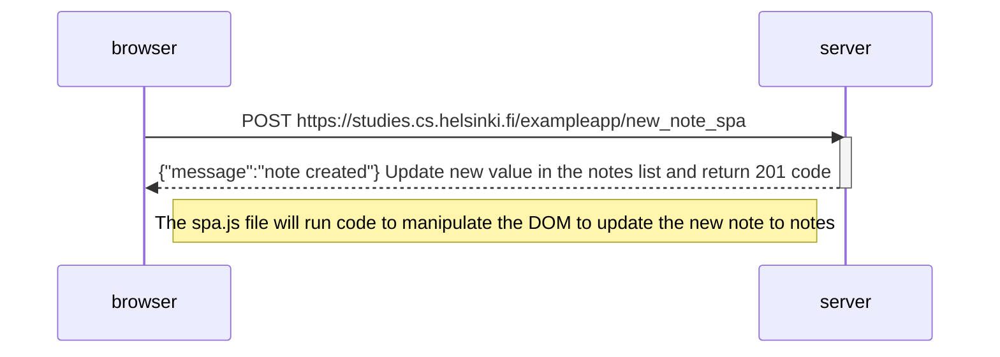

```mermaid
sequenceDiagram
    participant browser
    participant server

    browser->>server: POST https://studies.cs.helsinki.fi/exampleapp/new_note_spa
    activate server
    server-->>browser: {"message":"note created"} Update new value in the notes list and return 201 code 
    deactivate server

    Note right of browser: The spa.js file will run code to manipulate the DOM to update the new note to notes

```